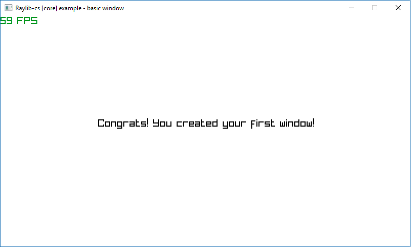

# Raylib-cs

Testing C# bindings for Raylib, a simple and easy-to-use library to learn videogames programming (www.raylib.com)

# TODO:
## cppsharp generator:
- Change #defines such as KEY_ENTER to static variables or enums.
- Add utility constructors for types -> Vector3(x, y, z).
- Add utility for cleaning up types so they are destroyed with the type.

## general
- Copy raylib.dll across to same directory as .exe automatically
- Add windows forms interface for generator
- Allow raylib to be used inside windows forms
- Convert across raylib examples

## Installation
Windows:
- Download the repository
- Open in visual studio
- Copy raylib.dll in Raylib-cs/raylib.dll
- Build and run

## Contributing
As I use this for my own projects, I know this might not be the perfect approach
for all the projects out there. If you have any ideas, just
[open an issue][issues] and tell me what you think.

If you'd like to contribute, please fork the repository and make changes as
you'd like. Pull requests are warmly welcome.

## Licensing
Raylib-cs is licensed under an unmodified zlib/libpng license, which is an OSI-certified, BSD-like license that allows static linking with closed source software. Check [LICENSE](LICENSE) for further details.
